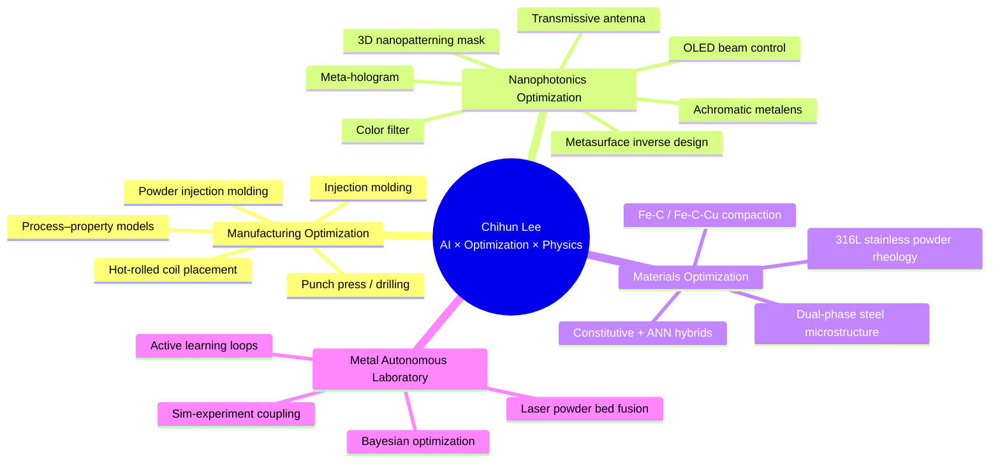
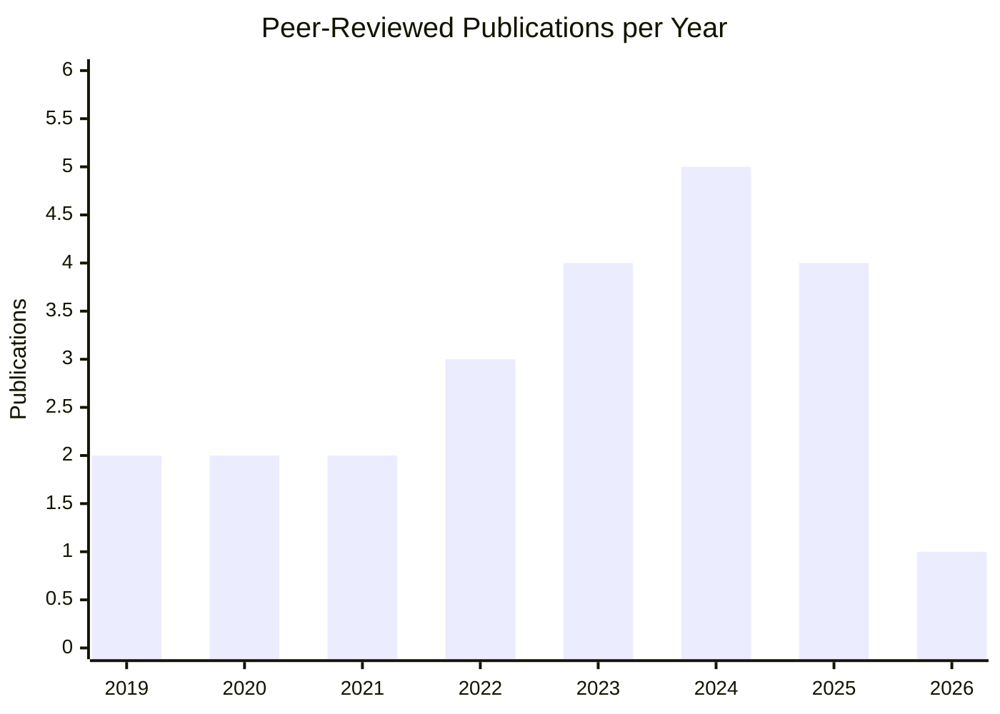
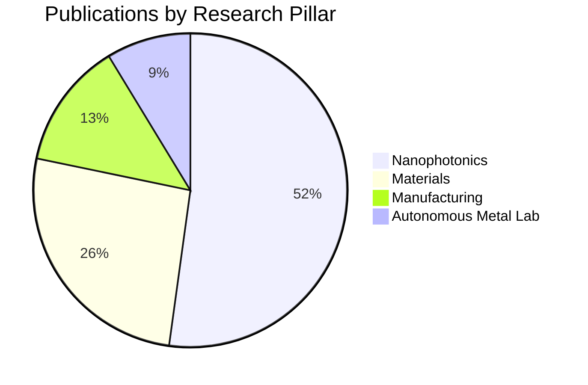
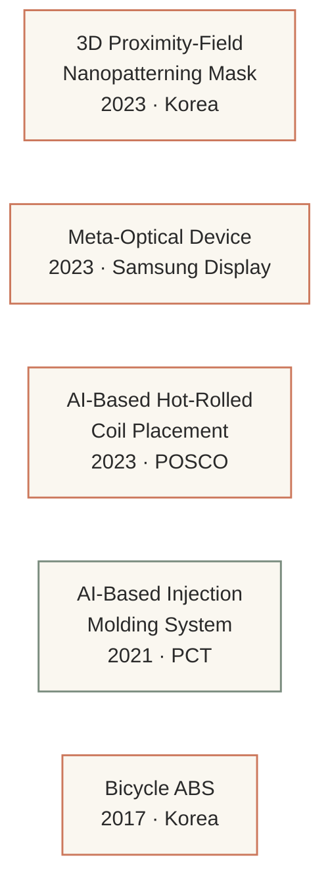
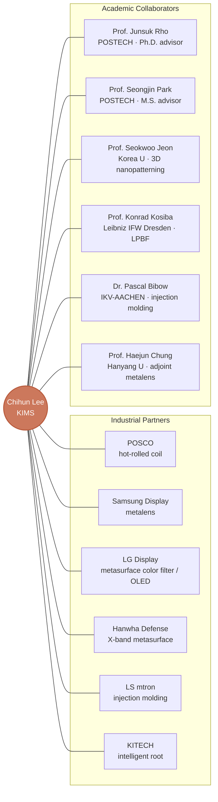
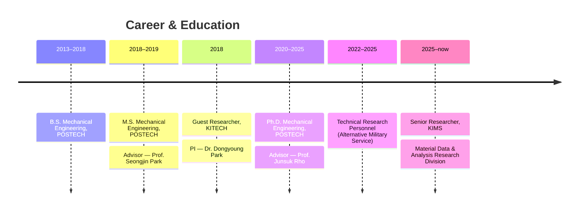

# Research Achievements — Chihun Lee, Ph.D.

> *Senior Researcher, Material Data & Analysis Research Division*
> *Korea Institute of Materials Science (KIMS)*
>
> Derived from `data/*.yaml` — last updated **2026-05-28**.
> See [`data/publications.yaml`](data/publications.yaml), [`data/projects.yaml`](data/projects.yaml), [`data/talks.yaml`](data/talks.yaml), [`data/patents.yaml`](data/patents.yaml).

---

## At a Glance

| | |
|---|---|
| **Total citations** | **733** |
| **h-index** | **12** |
| **i10-index** | **12** |
| **Peer-reviewed publications** | **23** (9 first-author / 14 co-author) |
| **Patents** | **5** (1 PCT, 4 Korea) |
| **Conference talks** | **11** (7 international / 4 domestic) |
| **Industry / national projects** | **8** |
| **Equal-contribution papers** | **10** |

---

## Research Map

I work at the intersection of optimization, machine learning, and physical sciences across **four interconnected pillars**. Each pillar feeds the next: manufacturing process data trains models that inform nanophotonic inverse design, while materials science grounds the autonomous metal laboratory that closes the loop back to manufacturing.

---

## Pillar 1 — Manufacturing Optimization (제조 최적화)

> Data-driven and physics-informed optimization for industrial manufacturing.
> *Industry partners: POSCO, LG Display, LS mtron, Samsung Display, KITECH.*

**Core publications**

| Year | Title | Venue | Role |
|------|-------|-------|------|
| 2025 | Real-Time Hot-Rolled Coil Placement Recommendation System with Data-Driven Model | *Advanced Intelligent Systems* | **First** (POSCO) |
| 2022 | Mass production of superhydrophilic micropatterned copper surfaces using powder injection molding process | *Powder Technology* | Co |
| 2020 | Development of artificial neural network system to recommend process conditions of injection molding for various geometries | *Advanced Intelligent Systems* | **First** |

**Funded projects**
- LS mtron (2018–2019) — AI injection-molding system, 60%+ mold set-up time reduction.
- POSCO (2020–2021) — Coil temperature deviation minimization in three-row curving yard.
- KITECH (2020–2025) — Intelligent root technology with add-on modules.

---

## Pillar 2 — Nanophotonics Optimization (나노포토닉스 최적화)

> Inverse design of metasurfaces and metamaterials using adjoint methods,
> automatic differentiation, neural surrogates, and global optimizers (PSO, GA, CMA-ES, DDQN, GP).
> *Industry partners: LG Display, Samsung Display, Hanwha Defense, Korea University.*

**Core publications**

| Year | Title | Venue | Role |
|------|-------|-------|------|
| 2025 | Benchmarking Optimization Methods Enabling Efficient Designs for Diverse Nanophotonic Applications | *Advanced Optical Materials* | **First** |
| 2025 | Structurally reordered crystalline atomic layer-dielectric hybrid metasurfaces for near-unity efficiency in the visible | *Materials Today* | Co |
| 2024 | Inverse-designed metasurface for highly saturated transmissive colors | *JOSA B* | Co-first |
| 2024 | Neutral-Colored Transparent Radiative Cooler by Tailoring Solar Absorption with Punctured Bragg Reflectors | *Advanced Functional Materials* | Co |
| 2023 | Inverse design meets nanophotonics: From computational optimization to artificial neural network | *Intelligent Nanotechnology* | Co-first (review) |
| 2022 | Concurrent Optimization of Diffraction Fields from Binary Phase Mask for 3D Nanopatterning | *ACS Photonics* | **First** |
| 2022 | Tutorial on metalenses for advanced flat optics | *J. Applied Physics* | Co-first (62 citations) |
| 2022 | Multicolor and 3D holography realized by inverse design of single-celled metasurfaces | *Advanced Materials* | Co (**271 citations**) |
| 2020 | Scalable and high-throughput top-down manufacturing of optical metasurfaces | *Sensors* | Co-first (60 citations) |

**Funded projects**
- LG Display (2020–2021) — Metasurface light control for OLED.
- LG Display (2021–2022) — Ultra-high-resolution metasurface color filter.
- Samsung Display (2022–2024) — High-refractive polymer absorber metalens.
- Hanwha Defense (2020–2021) — X-band metasurface propagation transformation.
- Korea University (2022–2025) — Hologram Printing & Encoding of Super-Depth-3D Pattern (HOPE).

---

## Pillar 3 — Materials Optimization (소재 최적화)

> AI-driven materials design and property prediction, grounded in constitutive
> relations and microstructure–property mappings.

**Core publications**

| Year | Title | Venue | Role |
|------|-------|-------|------|
| 2025 | Multi-fidelity learning-based latent diffusion model for 3D inverse microstructure design of dual phase steels | *Materials & Design* | Co |
| 2023 | Rheological Behavior of Water-atomized 316L Stainless Steel Powder depending on Particle Size | *Metals and Materials International* | Co |
| 2019 | Analysis of cold compaction for Fe-C, Fe-C-Cu powder design based on constitutive relation and ANN | *Powder Technology* | Co-first |
| 2019 | Correlation Study Between Material Parameters and Mechanical Properties of Iron–Carbon Compacts | *Metals and Materials International* | Co |

---

## Pillar 4 — Metal Autonomous Laboratory (금속 자율실험실)

> Closing the loop between simulation, optimization, and physical experiment
> for metal alloys. Active learning + Bayesian optimization driving efficient discovery.
> *International collaboration: Leibniz IFW Dresden (Prof. Konrad Kosiba).*

**Core publication**

| Year | Title | Venue | Role |
|------|-------|-------|------|
| 2021 | Optimizing laser powder bed fusion of Ti-5Al-5V-5Mo-3Cr by artificial intelligence | *J. Alloys and Compounds* | Co-first (62 citations) |

This pillar is the next phase of the work — translating the optimization toolkit into closed-loop experimentation hardware at KIMS.

---

## Publication Trajectory

---

## Top-Cited Papers

| Citations | Title | Venue | Year |
|-----------|-------|-------|------|
| 271 | Multicolor and 3D holography by inverse design of single-celled metasurfaces | *Adv. Materials* | 2022 |
| 62 | Tutorial on metalenses for advanced flat optics | *J. Appl. Phys.* | 2022 |
| 62 | Optimizing laser powder bed fusion of Ti-5Al-5V-5Mo-3Cr by AI | *J. Alloys Compd.* | 2021 |
| 60 | Scalable and high-throughput top-down manufacturing of optical metasurfaces | *Sensors* | 2020 |
| 59 | Design of a transmissive metasurface antenna using deep neural networks | *Opt. Mater. Express* | 2021 |

---

## Patents

| # | Title (EN) | Number | Year |
|---|-----------|--------|------|
| 1 | Electric-field-controlled 3D proximity-field patterning mask | 10-2023-0135822 | 2023 |
| 2 | Meta-optical device manufacturing (Samsung Display) | 10-2023-0085299 | 2023 |
| 3 | AI-based hot-rolled coil placement system (POSCO) | 10-2023-0133116 | 2023 |
| 4 | AI-based injection molding system | **WO 2021/049848 A1** (PCT) | 2021 |
| 5 | ABS for bicycles | 10-2017-0027222 | 2017 |

---

## Conference Talks

**International (7)** — Metamaterials 2024 (Crete, oral), Nano Korea 2023 (oral), MRS Spring 2023 (San Francisco, poster), Nano Convergence 2021 (virtual poster), IIMC 2019 (Aachen, oral), PM World Congress 2018 (Beijing, oral), AISM 2017 (Pohang, oral).

**Domestic (4)** — KSME Micro/Nano 2022 (oral), KSME Micro/Nano 2020 (poster), KSDME Winter 2018 (oral), KPMI 2018 (oral).

---

## Collaboration Network

---

## Career Timeline

---

## Technical Stack

**Forward simulation** — RCWA (in-house MATLAB) · FDTD (Lumerical, MEEP) · FEM (COMSOL) · Bulk optics (VirtualLab Fusion) · Scalar diffraction (in-house MATLAB).

**Learning & optimization** — PyTorch · TensorFlow · PSO · GA · CMA-ES · Adjoint method · Automatic differentiation · DDQN · Simulated Annealing · Gaussian Process (Bayesian Optimization).

**Manufacturing apps** — Injection molding · Hot-rolled coil placement · Punch press · Drilling · DED metal 3D printing · Powder injection molding · Powder manufacturing.

**Nanophotonics apps** — LED simulation & collimation · 3D patterning mask design · Color filter · Nano antenna · Achromatic metalens · Meta-hologram · Beam forming.

---

## What's Next

1. **Closing the autonomous metal lab loop** — Translate the LPBF optimization framework into an on-instrument active-learning controller at KIMS.
2. **Microstructure inverse design** — Extend the multi-fidelity latent diffusion approach (Jung et al. 2025) toward goal-conditioned generation for dual-phase and high-entropy alloys.
3. **Cross-pillar transfer** — Apply nanophotonic optimization tooling (adjoint, AD, neural surrogates) to manufacturing process design where gradients can be defined through differentiable simulators.

---

*This file is human-curated. The underlying facts live in `data/*.yaml` — edit there and run `./rebuild_all.sh` to propagate to CV, website, and LinkedIn drafts.*
